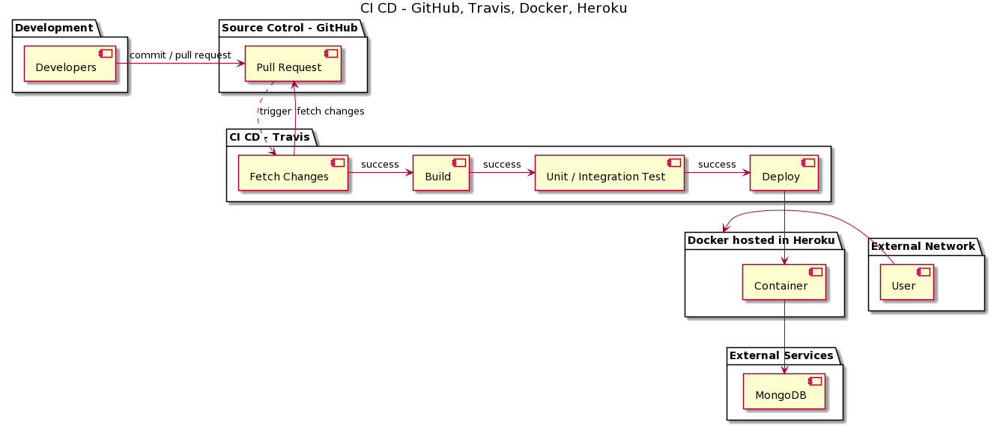

# docker-todo-node 
    docker + node + jest + supertest + travis
    
### 

## Heroku 
    https://docker-todo-node.herokuapp.com/

## Travis: Environment Variables
    HEROKU_API_KEY
    HEROKU_APP_NAME

